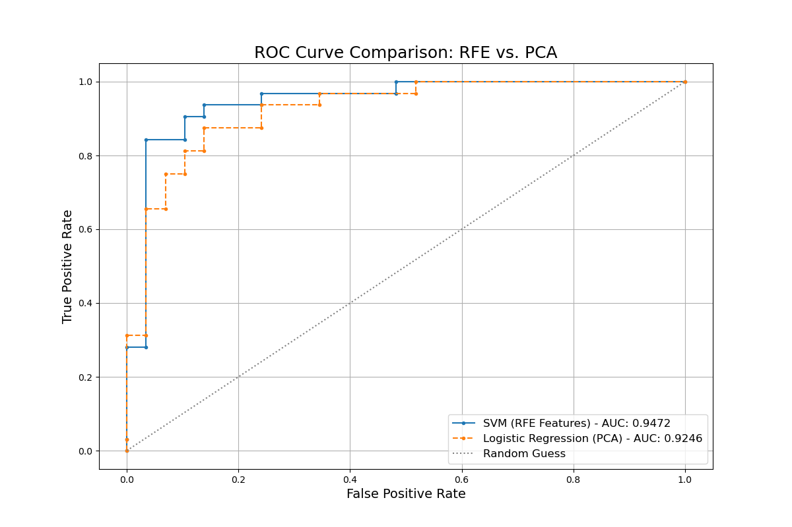

# Comprehensive Machine Learning Pipeline for Heart Disease Prediction


A complete, end-to-end data science project that predicts the likelihood of heart disease using the UCI Heart Disease dataset. This repository showcases a full project lifecycle from data cleaning and exploratory data analysis to feature engineering, model comparison, and hyperparameter tuning.



---

## 📋 Table of Contents
- [Project Overview](#-project-overview)
- [Project Workflow](#-project-workflow)
- [Dataset](#-dataset)
- [Methodology](#-methodology)
- [Key Results & Conclusion](#-key-results--conclusion)
- [Setup & Usage](#-setup--usage)

---

## 🎯 Project Overview

This project aims to develop a robust machine learning model to accurately predict the presence of heart disease in patients. By leveraging a standard medical dataset, we explore various data preprocessing techniques and modeling strategies to identify the most effective approach. The primary goal is to create a reliable classifier and document the scientific process of its development, from data exploration to final model optimization.

---

## 🚀 Project Workflow

The project is systematically structured into a series of Jupyter Notebooks, each responsible for a specific stage of the machine learning pipeline:

1.  **`01_Data_Preprocessing.ipynb`**: Handles all initial data tasks, including loading, cleaning, imputation, extensive Exploratory Data Analysis (EDA), and final data preparation (encoding and scaling).
2.  **`02_PCA_Analysis.ipynb`**: Explores dimensionality reduction by applying Principal Component Analysis (PCA) and analyzing the explained variance to find the optimal number of components.
3.  **`03_Feature_Selection.ipynb`**: Implements Recursive Feature Elimination (RFE) to select the most impactful subset of original features, providing a more interpretable alternative to PCA.
4.  **`04_Supervised_Learning.ipynb`**: The core modeling phase. Four different classification models (Logistic Regression, Decision Tree, Random Forest, SVM) are trained and rigorously evaluated on both the RFE-selected features and the PCA-transformed components.
5.  **`05_Unsupervised_Learning.ipynb`**: Explores the data for natural groupings without using labels, applying K-Means (with the Elbow Method) and Hierarchical Clustering (with Dendrograms).
6.  **`06_Hyperparameter_Tuning.ipynb`**: Takes the champion model from the supervised learning phase and uses GridSearchCV to find the optimal hyperparameters, maximizing its predictive performance.

---

## 📊 Dataset

The project utilizes the **Heart Disease UCI Dataset**. This dataset contains 76 attributes, but all published experiments refer to using a subset of 14 of them. The "goal" field refers to the presence of heart disease in the patient.

- **Source:** [UCI Machine Learning Repository](https://archive.ics.uci.edu/ml/datasets/heart+Disease)
- **Key Files:**
    - `data/heart_disease.csv`: The raw dataset.
    - `data/heart_disease_processed.csv`: The fully cleaned, encoded, and scaled dataset.
    - `data/heart_disease_rfe_features.csv`: The dataset with the best features selected by RFE.
    - `data/heart_disease_pca_features.csv`: The dataset transformed by PCA.

---

## 🛠 Methodology

The project follows a rigorous, comparative methodology:
- **Data Preparation:** The data was thoroughly cleaned, with missing values imputed using the mode. The target variable was binarized (0 for no disease, 1 for presence of disease).
- **Feature Engineering:** A head-to-head comparison was conducted between two strategies:
    1.  **Feature Selection (RFE):** To create a model based on the most powerful original features, enhancing interpretability.
    2.  **Dimensionality Reduction (PCA):** To create a model based on a smaller set of abstract components, prioritizing information density.
- **Model Evaluation:** Models were evaluated using a suite of metrics, including Accuracy, Precision, Recall, F1-Score, with the **ROC Curve and AUC Score** used as the final deciding factor for comparing the best models from each strategy.
- **Optimization:** The winning model was further optimized using **GridSearchCV** to fine-tune its hyperparameters.

---

## ✨ Key Results & Conclusion

The analysis concluded with the following key findings:

- The most effective data preparation strategy was **Recursive Feature Elimination (RFE)**.
- The best performing algorithm was the **Support Vector Machine (SVM)**.
- After hyperparameter tuning, the final SVM model achieved an **Accuracy of 88.52%** and a definitive **AUC score of 0.9472** on the held-out test set.

This indicates that an interpretable model built on a carefully selected subset of the original medical data provided the most reliable predictions.

---

## ⚙️ Setup & Usage

To replicate this analysis, please follow these steps:

1.  **Clone the Repository:**
    ```bash
    git clone [https://github.com/YourUsername/YourRepoName.git](https://github.com/YourUsername/YourRepoName.git)
    cd YourRepoName
    ```
2.  **Create and Activate a Virtual Environment:**
    ```bash
    python -m venv venv
    source venv/bin/activate  # On Windows, use `venv\Scripts\activate`
    ```
3.  **Install Dependencies:**
    ```bash
    pip install -r requirements.txt
    ```
4.  **Explore the Analysis:**
    You can now open the Jupyter Notebooks (`.ipynb` files) in the `notebooks/` directory to review the analysis step-by-step.
    ```bash
    jupyter lab
    ```
